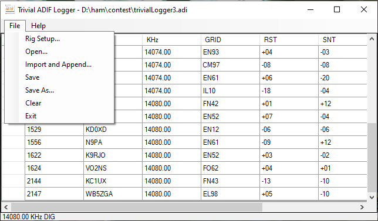

# TrivialAdifLogger
Minimal logging program based on ADIF and works with DigiRite version 2.2.2.8 or later.

DigiRite needs an external program to log its QSOs. Here is one. 
An already-built installer is available here: 
https://github.com/w5xd/TrivialAdifLogger/tree/master/InstallX86/bin/Release

All Trivial ADIF logger can do is read and write ADIF files, control a rig via its serial port, and connect itself to DigiRite.
You need DigiRite 2.2.2.8 also installed before Trivial ADIF logger will do anything useful.

<h2>How to build from sources</h2>

Requires hamlib. Currently built with Hamlib version 3.3
https://github.com/Hamlib/Hamlib/releases/tag/3.3

To build the x86 configuration, you must download and unpack the x86 hamlib build: 
https://github.com/Hamlib/Hamlib/releases/download/3.3/hamlib-w32-3.3.zip 
To build the x64 configuration, you must download and unpack the x64 hamlib build: 
https://github.com/Hamlib/Hamlib/releases/download/3.3/hamlib-w64-3.3.zip 

Or download and unpack both.
Once unpacked you must open and edit this file: HamLibClr/HamLib.props
Change the two HAMLIBROOT lines to the full path to your unpacked hamlib builds:
 <code>&lt;HAMLIBROOT&gt;D:\dev\hamlib-w32-3.3\ &lt;HAMLIBROOT&gt;</code> 
